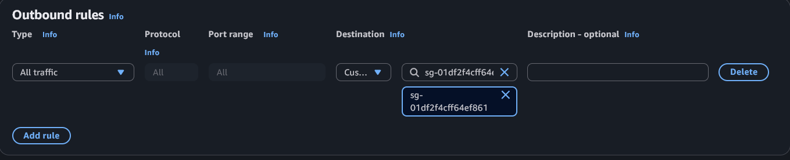

# EFS

The goal of this lab is to demonstrate how EFS works in AWS.

You should know the following:
- Have an AWS account
- Basic familiarity with the AWS management console
- Beginner level Linux CLI experience
    - How to ssh into a remote machine
    - Basic file operations from the command line

EFS stands for **Elastic File System**, and is one of the main three storage services AWS offers. Let's quickly compare them, so we can understand exactly what each is for.

### EBS (Elastic Block Store)
EBS is simple to understand if you compare them to VHDs when creating virtual machines. ec2 creates these volumes when a new instance is launched, for the OS.
- They are **directly attached** to an instance. A single EBS volume can typically only be attached to one resource at a time. 
- Their size is explicitly defined, and you pay for the total size.
    - They can be expanded easily, but shrinking requires workarounds.
- Usually used for **root volumes**

### EFS (Elastic File System)
EFS is like having a NAS (network attached storage) in your VPC (virtual private cloud). EFS operates over **NFS** (Network File System, TCP port 2049). You mount these **over the network**. This is best suited for files that multiple resources need to access, because they aren't attached 1-to-1 like EBS. They can be accessed by many resources at the same time.
- Shared storage for **multiple resources**
- Grows and shrinks **automatically**, you pay for what you use.
- Still mounted in the OS, so they can be treated like local storage from the OS perspective.
- Subject to **network restrictions**. SGs, firewalls, and routing must align to allow them to work.

### S3 (Simple Storage Service)
S3 is the most abstracted storage service of the three. S3 is **object based** whereas the others are file/blocksystem based. Ideal for static content such as media, web content, backups, etc. Data is stored as **objects** in **buckets** and are accessed over **HTTP/HTTPS**.
- Not a filesystem, and is not mountable.
- Completely web based
- Ideal for unstructured data
- Ridiculously scalable, durable, and available.

## Lab:
#### Goals:
- Create secure SGs that allow our EFS to communicate with other resources in our VPC
- Create an EFS
- Create an EC2 instance and attach our EFS **during setup**
- Write to the EFS.
- Create a second EC2 instance, attach our EFS **after setup**
- Verify we can read the data and write back and forth between the instances.

## 1. Create SGs
Because EFS is network-based, it's important to have SGs set up in advance that allow the network traffic. Remember, SGs are basically your firewall in the cloud.

1. Log into the AWS console
2. Open EC2 > Security Groups
3. Delete all groups except the "default" one.
4. Open default, verify there are no inbound rules. 

5. Verify there is one outbound rule allowing all outbound traffic, and no others.

6. Go back to Security Groups, and click Create Security Group.
    - **Create SG-HomeSSH**
      - Name: `SG-HomeSSH`
      - Description: `Allows SSH traffic from my home IP`
      - VPC: Keep default
      - Outbound Rules: Delete the default rule (allows all traffic)
      - Inbound Rules: Add a new rule
        - Type: `SSH` (port 22)
        - Source: `Custom`
        - Visit https://icanhazip.com to get your public IP, append `/32` (e.g., `192.168.1.1/32`) to specify a single IP, and select the suggested CIDR block.
        
        - Note: If your home IP changes in the future (common with ISPs), update this rule with your new IP to regain access to your resources.
7. Click **"Create security group"** to finalize the SG.
8. One more group! Go to Security groups and click "Create security group" again.
    - **Create SG-EFS**
      - Name: `SG-EFS`
      - Description: `Security group for EFS`
      - Outbound Rules: Click inside the search box on the default rule (allowing all traffic) and select your "default" sg. You may need to scroll.
        - What you're doing here is allowing your EFS to communicate OUTBOUND with any resource in your VPC with the "default" SG.
    
    
      - Inbound Rules: Add a new rule, set Type to NFS, and configure it so the source is the default SG again. This allows the EFS to accept traffic **inbound** on port 2049 **from** other resources in your default security group.
    
9. Click "Create security group" to finalize the SG.

You should now have the following SGs:
#### default
- The default sg for our resources.
- Allows all traffic outbound.

#### SG-HomeSSH
- Allows SSH traffic inbound from your home IP.
- Update if your ip changes
- Attach to resources you want to ssh into.

#### SG-EFS
- Group for your EFS file systems.
- Allows NFS traffic inbound from resources in your default sg.
- Allows all traffic outbound to resources in your default sg.

## Create EFS
Finally, it's time to make our EFS. 

1. Go to EFS > File systems
2. "Create file system"
3. Set a name and then click "Customize" at the bottom.
4. Scroll through and observe what you can configure, it's very customizable.
    - You can enable or disable automatic backups
    - You can configure lifecycle management, so files will automatically be moved to cheaper storage if it's not accessed as often (or not)
    - You can enable or disable encryption at rest
    - There's some performance settings too, some are cheaper than others.
5. For the purposes of this exercise, leave everything as default and click Next.
6. On the Network Access page, we can configure which AZs will have mount points. Each of these will need to be configured with your **SG-EFS SG**. On each mount target, under security groups, hit the X on the default SG and add your SG-EFS group. Each mount target should have the SG-EFS security group only, like so:

    - Mount points define where resources can connect to your EFS. So, if you only specify one subnet, only resources in that subnet can access it.
7. Click Next and then click Next on the File System Policy page as well. Finally, hit "Create" to create your EFS.

## Create EC2 Instance and Attach our EFS
Let's create an EC2 instance.

1. Head over to the EC2 console.
2. Launch instances
3. Set name to **EFS-Test-1**
4. Select Amazon Linux (default) for the AMI
5. Set the Instance type to **t2.micro**
6. Click "Create new key pair"
    - **If you already have a key pair and have the .pem file**, select that key pair and **proceed to step 8**
7. Enter a name, like "desktop" or "home-pc" or something. Leave everything default and click "Create key pair".
    - This will download a file. Keep track of where this file downloads to. This is the certificate that allows you to ssh into your instance.
8. Next to Network Settings" click "Edit"
9. **Select any subnet** from the drop down.
    - First is fine, this needs to be specified so we can attach the EFS automatically. 
    - I used one in the **use1-az4** availability zone.
    - Keep track of which you select for a future step
10. Under "Firewall" choose **"Select existing security group"**
11. Select your **"default"** and **"SG-HomeSSH"** security groups.
12. Under Storage > File systems click **"Show details"**
13. Select EFS and click "Add shared file system".
    - Notice how can specify the file system, and the mount point.
    - Mount point is **where the EFS will be mounted inside your os.**
    - Leave as default (/mnt/efs/fs1), but this is where you'd configure it if you needed to.
14. **Uncheck** "Automatically create and attach security groups".
    - We already made our own and attached them. 
    - Leave the second box for automatically mounting the EFS checked.
15. Click "Launch instance"

## Write to EFS.

Alright, if all has gone well so far we've created an EFS, and attached it to an EC2 instance. Now we'll SSH into the instance and write to the EFS.

1. SSH Into the instance.
**From any terminal**:
`ssh -i <"C:\Path\To\Keyfile.pem"> ec2-user@<instance ip>`
2. Ensure the EFS is attached by running the following:
`df -h`
You should see a line like this:
`127.0.0.1:/     8.0E     0  8.0E   0% /mnt/efs/fs1`

3. Write to a file in **/mnt/efs/fs1**
`sudo su`
`cd /mnt/efs/fs1`
`echo "Hello from EFS-Test-1!" >> hello.txt`
4. Make sure you can read it
`cat /mnt/efs/fs1/hello.txt`

## Create a second EC2 instance.

We're going to create a second EC2 instance, but configure the EFS **after setup via SSH**. If you're not as confident in your **Linux skills**, you can follow the same steps as before for our first EC2 instance, and just change the name to **EFS-Test-2**, then skip to the step **Read our message from EFS-Test-1!**. I'll walk you through every step though, so feel free to try this even if you don't know much Linux.

1. Create a new EC2 instance (leave EFS-Test-1 up!)
2. Set the name to **EFS-Test-2**
3. Same AMI, Amazon linux (default)
4. Instance type: **t2.micro**
5. Set the same **Key Pair** as before
6. Click **Edit** next to Network Settings
7. Select the same subnet as our first machine.
    - Not super important if you have the EFS in each AZ (default), but use the same as before to limit potential issues. (I used one in **use1-az4**)
8. Under firewall select **"Select existing security group"**
9. Add **"default"** and **"SG-HomeSSH"**
10. Leave everything else as default and click "Launch instance"

## Attach the EFS share

Now, since we didn't add the EFS from the console this time, we need to attach it using the **EFS Mount Helper**.

Official Guide: https://docs.aws.amazon.com/efs/latest/ug/mounting-fs-mount-helper-ec2-linux.html

1. From the **EFS console**, find and copy your **File System ID.**
    - eg. fs-3a9c7b1f842d506e2
2. SSH into **EFS-Test-2**
3. Run the following commands:
Elevate to root:
`sudo su`
Install the efs mount helper
`sudo dnf install -y amazon-efs-utils`
Make a directory where you'd like to mount the EFS:
(-p makes mkdir create the **parent** folders if they don't already exist)
`mkdir -p /mnt/efs/fs1`
Note how you don't see anything if you run this:
`ls /mnt/efs/fs1`
Let's mount our filesystem!
Replace "[fs-id]" with your filesystem id from step 1
`mount -t efs [fs-id] /mnt/efs/fs1`
eg. `mount -t efs fs-3a9c7b1f842d506e2 /mnt/efs/fs1`

## Read our message from EFS-Test-1!

And now, is our file from EFS-Test-1 there?
`ls /mnt/efs/fs1`
If you see "hello.txt", it's there! Let's cat it and see if our message displays.
`cat /mnt/efs/fs1/hello.txt`
Did it show?

Radical! We've created a shared filesystem between two ec2 instances! They can both utilize this simultaneously. 

## Key Takeaways
- It's important to consider SGs and **network restrictions** when dealing with EFS, since it's network based.
- EFS can **be shared** by two (or more) machines, a powerful tool if you need lots of computers to work with **shared data**.
- EFS tends to be **more expensive per GB** than S3 and EBS, but it's a fully managed, shared, scalable **filesystem-based** storage with low-latency access. Great value if you need these features, but EBS is way cheaper for filesystems and S3 is cheaper for object storage. 